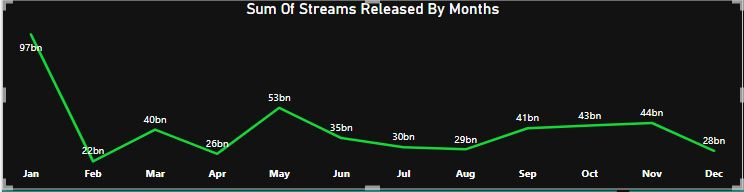
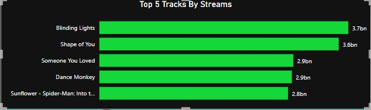
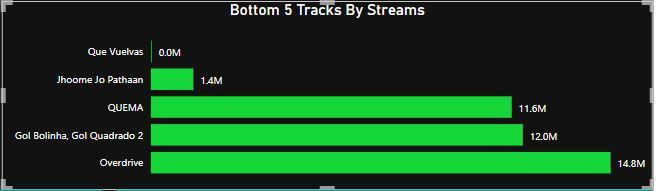

# Spotify_Analysis

## Introduction
Introducing Spotify Analytics Unveiled, the Power BI project that takes you into Spotify's musical realm! 📊🎵 Discover interesting insights from streaming data as we explore the rhythms of the digital space. Take a journey through the musical landscape with the top 5 artists shaping the playlists, uncover the beats behind the top and bottom tracks by streams, and see how monthly releases shape the musical landscapes. Discover the harmonies that make Spotify a unique audio experience as we analyze the stories hidden within the numbers.

## Problem Statement
I analyzed spotify_dataset in order to answer the following questions

1. What is the total stream released by months
2. What is the number of Tracks released by months
3. Top 5 Tracks by streams
4. Bottom 5 Tracks By streams
5. Top 5 Tracks by number of tracks released
6. Number of tracks by mode
## Skills and concept demostrated
 The following powerBI features were incorporated
 -DAX Concept:Calculated column,created measures,creating calendar table by using calendar_auto in other to effectively analyze trends over time
 -Filters
 -Book mark

 ## Data Sourcing 
 Link to the dataset used

 With the original dataset,the aim was to provide meaningful insights into user preference,track popularity and artist Influence within the spotify platform

 The spotify_dataset has 984 rows and 25 different features column.
 

-The different features names and description are

-Key Features of the Dataset:-

-track_name: Name of the song

-artist_name: Name of the artist of the song

-artist_count: Number of artists contributing to the song

-released_year: Year when the song was released

-released_month: Month when the song was released

-released_day: Day of the month when the song was released

-in_spotify_playlists: Number of Spotify playlists the song is included in

-in_spotify_charts: Presence and rank of the song on Spotify charts

-streams: Total number of streams on Spotify

-in_apple_playlists: Number of Apple Music playlists the song is included in

-in_apple_charts: Presence and rank of the song on Apple Music charts

-in_deezer_playlists: Number of Deezer playlists the song is included in

-in_deezer_charts: Presence and rank of the song on Deezer charts

-in_shazam_charts: Presence and rank of the song on Shazam charts

-bpm: Beats per minute, a measure of song tempo

-key: Key of the song

-mode: Mode of the song (major or minor)

-danceability_%: Percentage indicating how suitable the song is for dancing

-valence_%: Positivity of the song's musical content

-energy_%: Perceived energy level of the song

-acousticness_%: Amount of acoustic sound in the song

-instrumentalness_%: Amount of instrumental content in the song

-liveness_%: Presence of live performance elements

-speechiness_%: Amount of spoken words in the song

## Data Transformation
Data was transformed and prepared using powerQuery editor.

Removing unnecessary columns

Ensuring the right data type

Creating new column for date

Removing duplicates values

Creating a new date table and create relationship between the dataset and the table

Creating new measures(Total Streams,Numbers of tracks,Average beat per minutes)

## Analysis

### Total strems released by months

January has the highest number of streams of 97bn ,and the highest number of tracks with 133, released comapared to other months

### Top 5  Tracks By streams And Bottom 5 Tracks By Streams

Blinding light has the highest number of streams of 3.7bn while Que Vuel has the lowest no of streams by 0M

### Top 5 Artist By Number Of Tracks Released

Taylor swift has the highest no of tracks relaesed of 34

 
   

